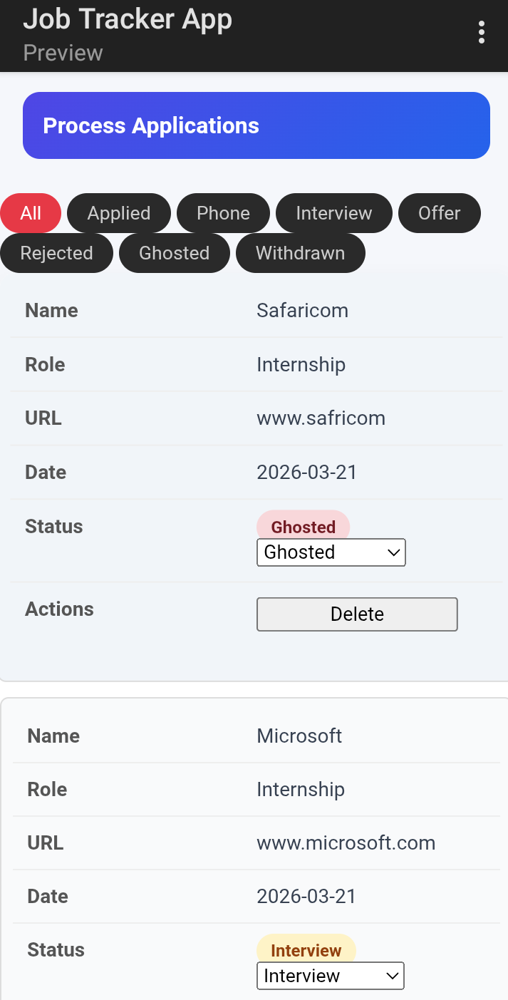
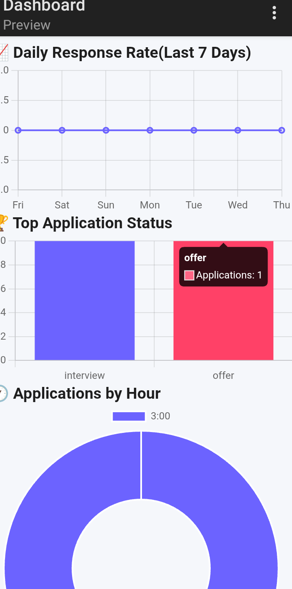

#  Job Application Tracker

A lightweight web app for tracking your job search  log every application, monitor its stage, follow up on time, and visualize your success rate with a built-in dashboard.

> Built with vanilla JavaScript, HTML, and CSS. No frameworks. No backend. Just fast, persistent, and practical.

---

##  Live Demo

 **Live Demo:** [amanidy.github.io/job-tracker](https://amanidy.github.io/job-tracker)
---

##  Screenshots


 
 
  

---

## Features

- **Add Applications** — Log company name, role, date applied, and current status
- **Track Stages** — Applied → Interview → Offer → Rejected → Followed Up
- **Filter by Status** — Quickly view applications at any stage
- **Success Rate Dashboard** — Chart.js visualization of your application outcomes
- **Persistent Storage** — All data saved to localStorage, survives page reloads
- **No Login Required** — Works entirely in the browser

---

##  Tech Stack

| Technology | Purpose |
|---|---|
| HTML5 | Structure |
| CSS3 | Styling & responsive layout |
| Vanilla JavaScript | Logic & DOM manipulation |
| Chart.js | Analytics dashboard |
| localStorage | Client-side data persistence |

---

##  Getting Started

### Run Locally

```bash
git clone https://github.com/amanidy/job-tracker.git
cd job-tracker
```

Then open `index.html` in your browser. No installs needed.

---


## 💡 Why I Built This

Tracking job applications in a spreadsheet gets messy fast. I wanted something purpose built a clean UI that shows exactly where every application stands and whether I need to follow up. Built it, used it, and learned a lot about localStorage data management and Chart.js along the way.

---

##  Author

**Arnold Amani**
- GitHub: [@amanidy](https://github.com/amanidy)

---
